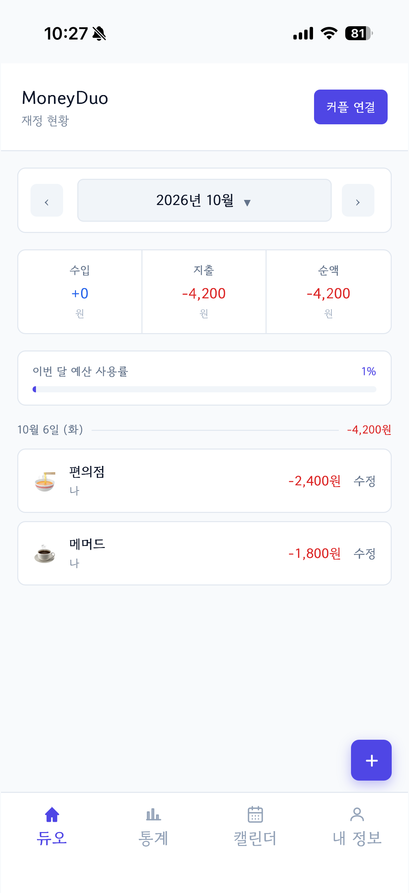
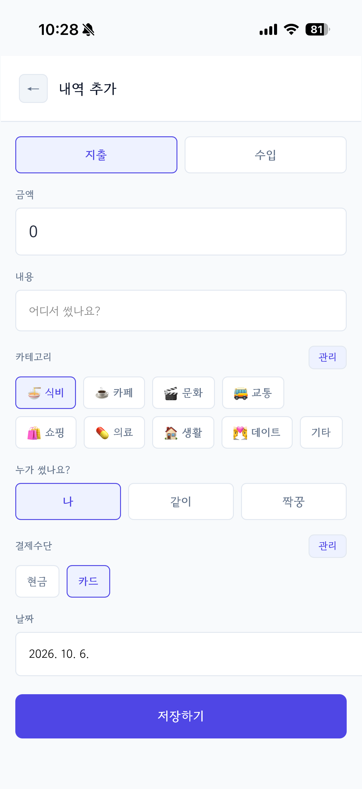
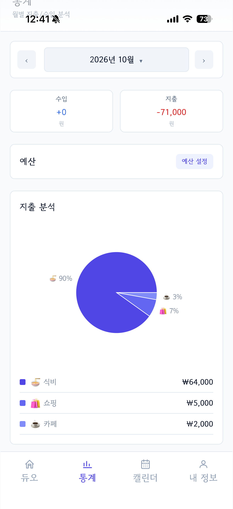
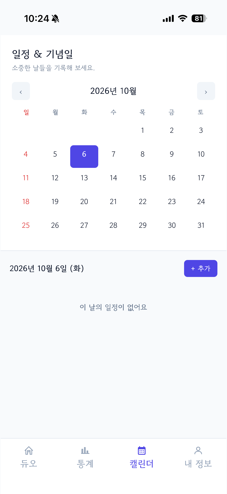
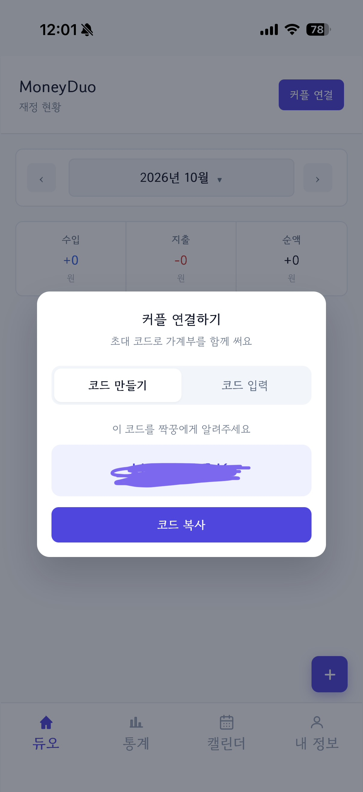
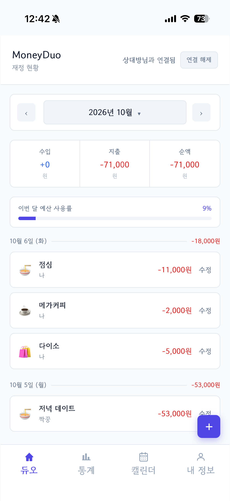
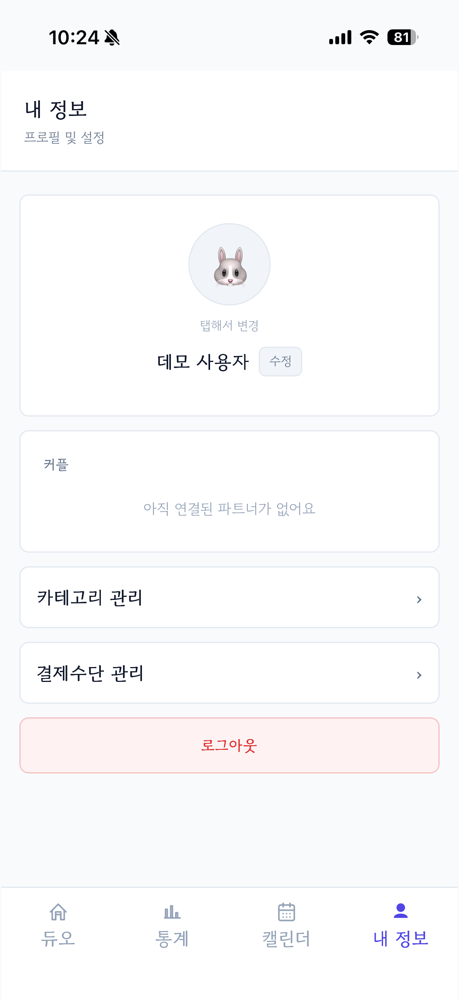
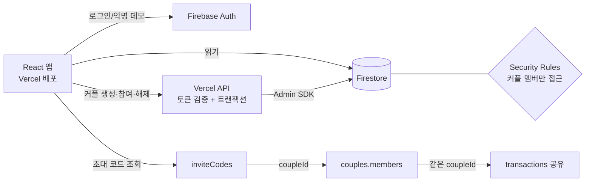

# 💑 MoneyDuo — 커플 공동 가계부

둘이서 함께 쓰는 가계부 웹앱입니다. 초대 코드로 짝꿍과 연결하면 서로의 지출을 실시간으로 공유하고, 월 예산과 카테고리별 한도를 함께 관리할 수 있습니다.

> **만든 이유:** 데이트통장을 만들려다가, 먼저 둘이 쓰는 지출이 얼마나 되는지 알아야 한다고 생각했습니다. 각자 따로 적으면 합산과 정산이 번거로워서, 같은 가계부를 실시간으로 함께 보고 누가 결제했는지까지 구분해 기록하는 앱을 직접 설계·구현했습니다. 서버 없이 Firebase만으로 인증·실시간 동기화·권한 제어를 해결하는 것이 기술 목표였습니다.

|                  |                                                                                            |
| ---------------- | ------------------------------------------------------------------------------------------ |
| 🔗 **배포 링크** | https://moneyduo.vercel.app                                                                |
| 📘 **API 문서** | https://moneyduo.vercel.app/api-docs.html (Swagger UI, Authorize에 Firebase ID 토큰 입력) |
| 🧪 **체험 방법** | 로그인 화면의 **데모 로그인** 클릭 (방문자마다 독립된 익명 계정 생성, 가입 불필요)         |
| 📅 **개발 기간** | 2026.06 ~ 2026.10 (1인 개발)                                                               |
| 🛠 **기술 스택** | React 19 · TypeScript · Vite · Tailwind CSS · Firebase(Auth/Firestore) · Recharts · Vercel |

## 📱 주요 화면

<table>
  <tr>
    <td align="center"><br>로그인</td>
    <td align="center"><br>홈 (내역·예산)</td>
    <td align="center"><br>내역 추가</td>
    <td align="center"><br>통계</td>
  </tr>
  <tr>
    <td align="center"><br>캘린더</td>
    <td align="center"><br>커플 초대 코드</td>
    <td align="center"><br>커플 공유 홈</td>
    <td align="center"><br>내 정보</td>
  </tr>
</table>

## ✨ 주요 기능

| 기능           | 설명                                                          |
| -------------- | ------------------------------------------------------------- |
| 커플 연결      | 6자리 초대 코드로 연결/해제. 연결하면 연결 전 내역까지 서로 열람(연결 직전에 확인창으로 안내) |
| 수입·지출 기록 | 금액/카테고리/메모/날짜/결제자(나·짝꿍·같이) 입력, 수정, 삭제 |
| 결제수단       | 현금/카드 선택 및 직접 관리                                   |
| 월별 조회      | 월 이동, 나/짝꿍/같이/전체 필터                               |
| 예산 관리      | 월 예산, 카테고리별 한도 설정과 사용률 표시                   |
| 통계 차트      | 카테고리별 지출 비율 도넛 차트                                |
| 일정/기념일    | 캘린더에 일정 등록·수정                                       |
| 홈 화면 추가(PWA) | 모바일에서 홈 화면에 추가하면 주소창 없이 앱처럼 실행 (아이폰: 공유 → 홈 화면에 추가 / 안드로이드: 메뉴 → 홈 화면에 추가) |
| 카테고리 관리  | 사용자별 카테고리 추가/수정                                   |

## 🧱 기술 구성

| 영역       | 선택                              | 이유                                |
| ---------- | --------------------------------- | ----------------------------------- |
| 프론트엔드 | React + TypeScript + Vite         | 타입 안정성, 빠른 개발 환경         |
| 스타일     | Tailwind CSS                      | 모바일 중심 UI를 빠르게 구성        |
| 인증/DB    | Firebase Auth, Firestore          | 서버 없이 실시간 동기화와 인증 해결 |
| 서버       | Vercel 서버리스 함수 + Firebase Admin SDK | 커플 연결 로직과 권한 검증을 서버로 이전 |
| 차트       | Recharts                          | React 컴포넌트로 선언적 구성        |
| 배포       | Vercel (`main` push 시 자동 배포) | CI/CD 설정 불필요                   |

## 🏗 아키텍처



## 🔥 문제 해결 경험

| 문제                                       | 원인                                                                                             | 해결                                                              |
| ------------------------------------------ | ------------------------------------------------------------------------------------------------ | ----------------------------------------------------------------- |
| 커플이 서로의 거래를 못 읽음               | 보안 규칙이 작성자의 "현재" coupleId와 비교해, 커플 재구성 이력이 있으면 목록 쿼리 전체가 거부됨 | 거래 문서에 저장된 `coupleId`와 비교하도록 규칙 변경              |
| 가입 직후 `permission-denied`              | `coupleId` 필드가 없는 문서를 `.data.coupleId`로 접근해 규칙 평가 오류 발생                      | `get('coupleId', null)`로 안전하게 읽도록 규칙 수정               |
| 같은 결제자가 사람마다 반대로 보임         | `paidBy`가 작성자 기준("나")으로 저장됨                                                          | 보는 사람이 작성자가 아니면 나/짝꿍을 뒤집어 표시 (`paidByLabel`) |
| 월을 빠르게 넘기면 이전 달 데이터가 표시됨 | 이전 요청의 응답이 늦게 도착해 덮어씀                                                            | 오래된 응답을 무시하는 가드 추가                                  |
| 데모 계정이 방문자끼리 공유됨              | 고정 계정으로 로그인                                                                             | Firebase 익명 로그인으로 방문자마다 독립 계정 사용                |
| 거래 조회 쿼리 실패                        | `coupleId + date` 복합 쿼리에 인덱스 없음                                                        | 복합 인덱스 등록 (`firestore.indexes.json`)                       |
| 일부 모바일에서 조회가 약 30초 지연 (체감) | 네트워크가 스트리밍 응답을 모아뒀다가 30초 뒤 전달. `experimentalAutoDetectLongPolling`은 연결 시작 시점만 판단해 이 경우를 못 잡음 | 단계별 소요시간을 임시 측정해 원인을 좁힌 뒤 `experimentalForceLongPolling`으로 고정 |
| 커플 연결/해제가 느림                      | 순차 조회와 여러 번의 개별 쓰기로 왕복 횟수가 많음                                               | 조회 병렬화, 쓰기를 단일 배치로 통합, 화면에 있는 커플 정보를 넘겨 서버 조회 생략, 커플 ID 캐시를 결과로 즉시 갱신 |
| 첫 화면 로딩이 느림                        | 폰트가 렌더링을 막고 모든 페이지가 한 번에 로드됨                                                | 폰트 렌더링 차단 제거, 페이지 지연 로딩(lazy). 메인 번들 964 kB → 612 kB (gzip 289 kB → 188 kB) |

## 🗂 데이터 구조 (Firestore)

| 컬렉션         | 문서 ID  | 주요 필드                                                  | 읽기 / 쓰기                         |
| -------------- | -------- | ---------------------------------------------------------- | ----------------------------------- |
| `users`        | uid      | displayName, photoURL, `coupleId`                          | 본인 / 같은 커플 읽기, 본인만 쓰기  |
| `couples`      | 자동     | `members`(uid 배열), `inviteCode`                          | 단건 조회는 로그인 사용자, 목록은 멤버만. 가입·탈퇴는 규칙으로 제한 |
| `inviteCodes`  | 6자리 코드 | `coupleId`                                               | 코드로 단건 조회·생성만 (목록/덮어쓰기/삭제 불가) |
| `transactions` | 자동     | amount, category, type, paidBy, date, `createdBy`, `coupleId` | 같은 커플 읽기, 작성자만 수정·삭제 |
| `userSettings` | uid      | 카테고리, 결제수단, 예산                                   | 본인만                              |
| `schedules`    | 자동     | 일정/기념일, `createdBy`                                   | 본인만                              |

**커플 연결 흐름**

1. A가 커플 생성 → `inviteCodes/{코드}`(→ coupleId) 발급 후 `couples` 문서 생성, A의 `users.coupleId` 설정
2. B가 코드 입력 → `inviteCodes/{코드}`로 coupleId를 찾아 `members`에 본인 추가, B의 `users.coupleId` 설정
3. 이후 거래는 `coupleId`와 함께 저장되고, 같은 `coupleId`를 가진 두 사람이 서로 읽을 수 있음

## 🔐 보안 설계 (Firestore Rules)

- 거래 수정/삭제는 작성자만 가능, 읽기는 같은 커플만 가능
- `users.coupleId`는 해당 커플의 멤버일 때만 변경 가능 (임의로 남의 커플에 들어갈 수 없음)
- 커플 생성·참여·해제는 서버 API(Admin SDK)만 수행하고, 규칙은 클라이언트의 `couples` 쓰기와 `users.coupleId` 변경을 모두 거부

**규칙 자동 검증:** Firebase 에뮬레이터 + Vitest로 규칙 22개 시나리오를 검증합니다 ([tests/firestore.rules.test.ts](tests/firestore.rules.test.ts)). 다른 커플의 거래 열람, 작성자 위조, 남의 커플로 임의 가입, `coupleId` 필드가 없는 신규 가입자 같은 케이스가 포함되며, 규칙을 일부러 느슨하게 바꾸면 해당 테스트가 실패하는 것까지 확인했습니다.

## 📁 폴더 구조

```
api/
├─ couple/       커플 생성·참여·해제 API (create, join, leave)
└─ _lib/         서버 공용 (coupleOps 로직, 토큰 검증 admin/handler)
src/
├─ pages/        화면 (홈, 차트, 일정, 입력/수정, 마이페이지 …)
├─ components/   공통 컴포넌트 (하단 네비게이션, 월 이동)
├─ services/     Firestore 접근 (coupleService, transactionService)
├─ types/        공통 타입
└─ firebase.ts   Firebase 초기화
```

## 🚀 실행 방법

```bash
npm install
npm run dev        # 개발 서버
npm run build      # 타입 체크 + 빌드
npm test           # 보안 규칙·서버 로직 테스트 (Java 필요, 에뮬레이터 자동 실행)
```

`src/firebase.ts`의 Firebase 설정이 필요합니다.

`/api`는 `vite dev`에서 동작하지 않습니다. 커플 연결까지 로컬에서 확인하려면 `npx vercel dev`를 쓰고, 서버에는 환경변수 `FIREBASE_SERVICE_ACCOUNT`(서비스 계정 JSON 한 줄)가 필요합니다.

## ⚠️ 배포 시 주의사항: Firestore 규칙

`git push`(코드 배포)와 `firebase deploy --only firestore:rules`(규칙 배포)는 **별개의 배포 경로**입니다.

- `/deploy-moneyduo`를 쓰면 [firestore.rules](firestore.rules) 변경분이 있을 때 push 전에 규칙도 함께 배포됩니다.
- 직접 `git push`만 했다면 규칙은 반영되지 않으므로 `npm run deploy:rules`를 따로 실행해야 합니다.
- 배포된 규칙은 만료되지 않습니다. (Firebase 기본 "테스트 모드" 규칙만 30일 후 만료)

## 📝 배운 점 / 개선 계획

- 보안 규칙은 "필드가 없을 때"까지 고려해야 한다는 점을 배웠습니다.
- 클라이언트만으로는 커플 가입 같은 권한 로직에 한계가 있다는 점도 배웠습니다.
- 개선 예정: 커플 가입/탈퇴를 Cloud Function으로 이전, 예산 초과 알림, 거래 내역 검색
